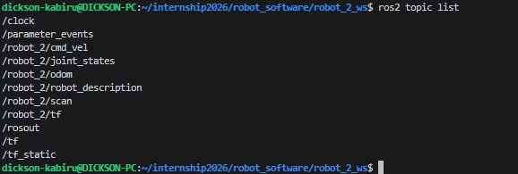

# robot_2_bringup

This package manages the configuration parameters, network communication interfaces, and unified launch workflows required to initialize and execute the Robot 2 system profile.

---

## 🛠️ Execution and Running Instructions

To launch the integrated multi-node simulation graph, execute the master launch file from your workspace root. This single script processes your unified xacro description, fires up the Gazebo simulation environment, handles hardware coordinate entity spawning, and spins up the namespaced parameters link bridge.

```bash
cd robot_software/robot_2_ws
source install/setup.bash
ros2 launch robot_2_bringup launch_sim.launch.py
```

---

## 🎮 Teleoperation Manual Control

Drive the robot manually around the competition gamefield by opening an independent terminal session, sourcing your workspace, and executing the namespaced keyboard teleoperation package node:

```bash
cd robot_software/robot_2_ws
source install/setup.bash
ros2 run teleop_twist_keyboard teleop_twist_keyboard --ros-args -r /cmd_vel:=/robot_2/cmd_vel
```

*Ensure your target terminal view retains system pointer focus while executing keystrokes to pass raw linear and angular inputs to the velocity handler.*

---

## 📡 Isolated Architecture Verification

In strict alignment with lab safety rules, all nodes, odometry streams, state profiles, and sensor pipelines operate exclusively inside the `/robot_2` namespace topology to avoid real-world radio and network node collisions during testing.

### Active unique topics
Below is the running status capture showing the isolated topics:



* **Velocity Controller Interface:** `/robot_2/cmd_vel`
* **LiDAR Sensor Array Feed:** `/robot_2/scan`
* **Transform Trees Data:** `/robot_2/tf`
* **Robot Description:** `/robot_2/robot_description`
* **Odometry Tracking feed:** `/robot_2/odom`
