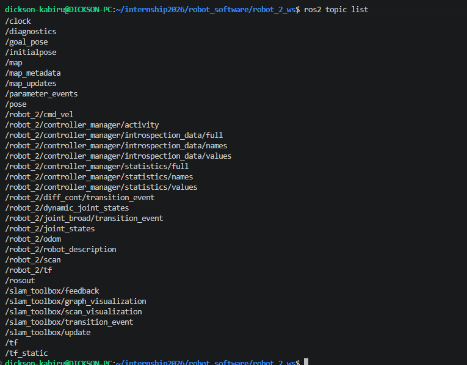

# robot_2_bringup

This package manages the configuration parameters, network communication interfaces, and unified launch workflows required to initialize and execute the Robot 2 system profile.

---

## 🛠️ Execution and Running Instructions

To launch the integrated multi-node simulation graph, execute the master launch file from your workspace root. This single script processes your unified xacro description, fires up the Gazebo simulation environment, handles hardware coordinate entity spawning, and spins up the namespaced parameters link bridge.

```bash
cd robot_software/robot_2_ws
source install/setup.bash
ros2 launch robot_2_bringup launch_sim.launch.py
```

Gazebo runs **headless** (server-only, no 3D GUI window) by default — this is intentional, to keep CPU/rendering load down on machines without GPU-accelerated OpenGL (e.g. WSL2 without GPU passthrough, which falls back to slow software rendering and can cause dropped sensor data). Use RViz for all visualization instead (see below).

### Launch arguments

| Argument | Default | Description |
|---|---|---|
| `use_ros2_control` | `true` | Use the `ros2_control` drive stack. Set `false` to use Gazebo's native `DiffDrive` plugin instead. |
| `world` | `gamefield.world` | Path to the world file to load. |
| `spawn_x` / `spawn_y` / `spawn_z` | `-1.18` / `2.44` / `0.05` | Robot's starting position on the gamefield. |
| `spawn_yaw` | `0.0992` | Robot's starting heading (radians). |

Example overriding the spawn point for testing:
```bash
ros2 launch robot_2_bringup launch_sim.launch.py spawn_x:=0.0 spawn_y:=0.0
```

---

## 🎮 Teleoperation Manual Control

Drive the robot manually around the competition gamefield by opening an independent terminal session, sourcing your workspace, and executing the namespaced keyboard teleoperation package node:

```bash
cd robot_software/robot_2_ws
source install/setup.bash
ros2 run teleop_twist_keyboard teleop_twist_keyboard --ros-args -p stamped:=true -r /cmd_vel:=/robot_2/cmd_vel
```

> **`-p stamped:=true` is required.** On ROS 2 Jazzy, `diff_drive_controller`'s `cmd_vel` input only accepts `geometry_msgs/msg/TwistStamped`; without this flag `teleop_twist_keyboard` publishes plain `Twist` and the robot will not move.

*Ensure your target terminal view retains system pointer focus while executing keystrokes to pass raw linear and angular inputs to the velocity handler.*

Keys: `i` forward, `,` reverse, `j`/`l` turn, `k`/space = stop. The controller has a `cmd_vel_timeout` of 0.5s, so the robot also stops on its own shortly after you stop sending commands.

---

## 🗺️ SLAM Mapping

`slam_toolbox` (online async, mapping mode) launches automatically as part of `launch_sim.launch.py`. To visualize the map as it builds:

```bash
rviz2 -d src/robot_2_bringup/rviz/slam.rviz
```
Set **Fixed Frame** to `map`.

To save a completed map:
```bash
ros2 service call /slam_toolbox/save_map slam_toolbox/srv/SaveMap "{name: {data: 'my_map'}}"
```

---

## 📡 Isolated Architecture Verification

In strict alignment with lab safety rules, all **topics** operate inside the `/robot_2` namespace to avoid real-world radio and network node collisions during testing.

> **Note:** `tf` and `tf_static` are the exception — `tf2` broadcasters always publish to the **global** `/tf`/`/tf_static` topics regardless of node namespace, by ROS 2 design (the same is true of `/clock`). Frame *names* within the tf tree (`base_link`, `chassis`, `laser_frame`, etc.) are also unprefixed/global, not `/robot_2/...`-namespaced, so they resolve consistently for RViz, `slam_toolbox`, and any other tooling that expects the standard frame names.

### Active unique topics
Below is the running status capture showing the isolated topics:



* **Velocity Controller Interface:** `/robot_2/cmd_vel` (`geometry_msgs/msg/TwistStamped`)
* **LiDAR Sensor Array Feed:** `/robot_2/scan`
* **Odometry Tracking feed:** `/robot_2/odom`
* **Robot Description:** `/robot_2/robot_description`
* **Occupancy Map:** `/map` (unnamespaced — published by `slam_toolbox`)
* **Transform Tree Data:** `/tf`, `/tf_static` (global, not namespaced — see note above)